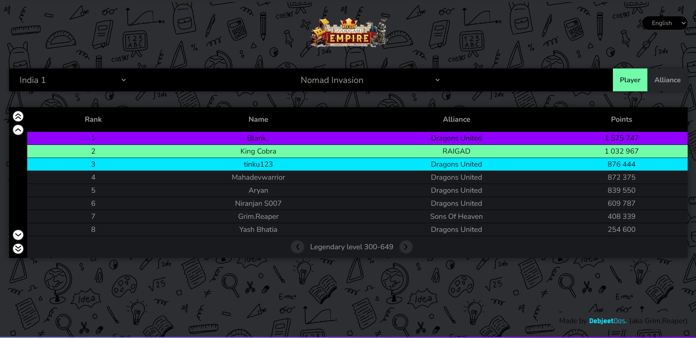

# Goodgame Empire Ranking System

  

This Git repository is to manage the ranking system for Goodgame Empire. This project is forked from [danadum/empire-rankings](https://github.com/danadum/empire-rankings), and some modifications have been made to it.




## Acknowledgements

Thanks to [danadum](https://github.com/danadum) for creating the original repository. Without his work, this project wouldn't be possible.

## Demo

The live demo of this project [here](https://dasdebjeet.github.io/goodgame_empire_ranking).

## Features

- Provides a ranking system for Goodgame Empire.
- Allows users to view rankings based on various categories.
- Supports multiple languages and servers.

## Installation

To use this project, simply clone the repository:

```bash
https://github.com/dasdebjeet/goodgame_empire_ranking.git
